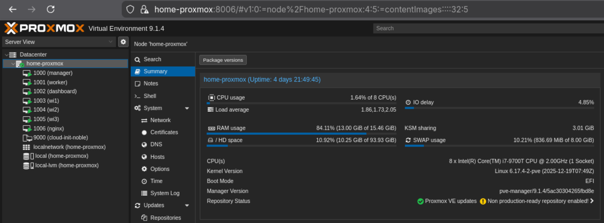
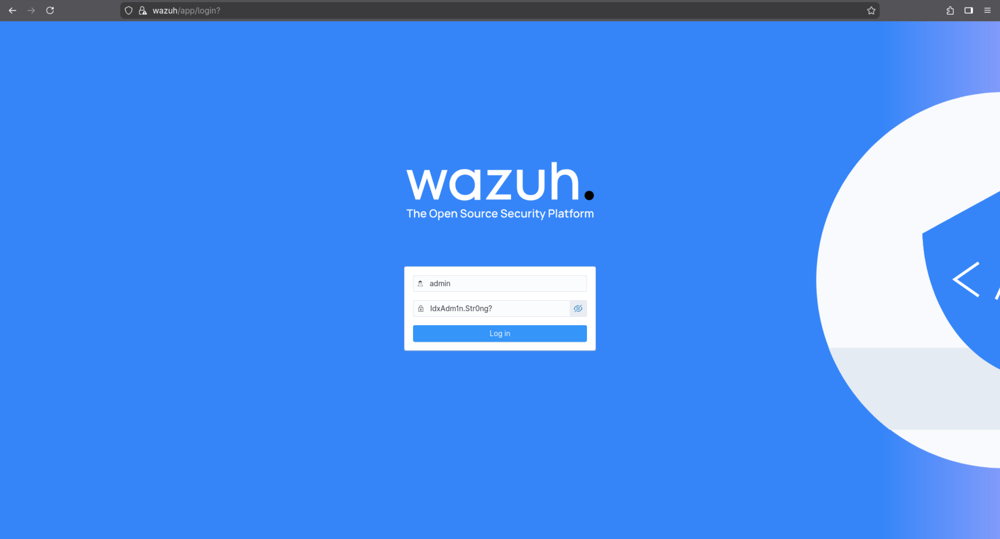
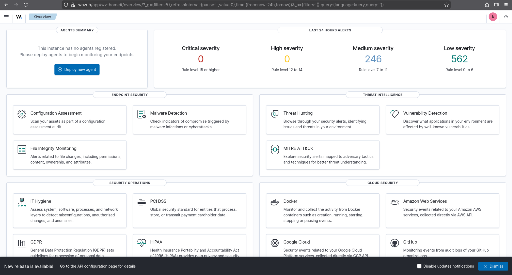

# Wazuh Cluster Deployment with Terraform and Ansible over Proxmox
This repository automates the creation of virtual machines and the provisioning of a distributed Wazuh cluster on Proxmox using Terraform and the official Wazuh Ansible playbooks.

The main objective of this project is to provide a ready-to-use Wazuh cluster where all architectural and operational decisions are defined once inside a single `secret.tfvars` file. No manual post-installation steps are required, Terraform takes care of everything.

The implementation follows the official Wazuh documentation and extends it with automation around certificates, overrides, credentials, and infrastructure lifecycle.



## Repository Layout
```
├── ansible/
│   ├── wazuh-ansible/                      # Official Wazuh Ansible submodule (pinned release)
│   ├── inventory.ini                       # Generated by Terraform
│   ├── base.yml                            # Generated by Terraform
│   ├── wazuh-overrides.yml                 # Generated by Terraform
│   ├── passwords-indexer.yml               # Generated by Terraform
│   └── wazuh-ansible/playbooks/indexer/
│       └── certificates/
│           ├── config.yml                  # Generated by Terraform
│           └── wazuh-certs-tool.sh         # Auto-downloaded certificate tool
│
├── terraform/
│   ├── main.tf
│   ├── provider.tf
│   ├── variables.tf
│   ├── version.tf
│   ├── secret.tfvars.template
│   └── secret.tfvars                       # Single config source
│
└── README.md
```

## Requirements
- Proxmox ([install proxmox guide](https://www.proxmox.com/en/products/proxmox-virtual-environment/get-started) and [vlan guide](https://www.youtube.com/watch?v=stQzK0p59Fc))
- Terraform ([install terraform guide](https://developer.hashicorp.com/terraform/tutorials/aws-get-started/install-cli))
- Ansible installed locally or on a control VM
  ```bash
  apt install ansible
  ```
- [SSH keys for provisioning](#ssh-key-for-provisioning)
- Cloud-Init enabled VM template on Proxmox ([setup template guide](https://gist.github.com/zidenis/dfc05d9fa150ae55d7c87d870a0306c5))
  ```bash
  apt install cloud-init
  ```

## Setup

### Proxmox API User
Terraform connects to Proxmox using a dedicated API user. The following commands create an example role matching the provider documentation / common required privileges:

1. create role

```bash
pveum role add TerraformProv -privs "Datastore.AllocateSpace Datastore.Audit Pool.Allocate Sys.Audit Sys.Console Sys.Modify VM.Allocate VM.Audit VM.Clone VM.Config.CDROM VM.Config.Cloudinit VM.Config.CPU VM.Config.Disk VM.Config.HWType VM.Config.Memory VM.Config.Network VM.Config.Options VM.Migrate VM.PowerMgmt SDN.Use Pool.Audit"
```

2. create user

```bash
pveum user add terraform-prov@pve --password "password!!!"
```

3. assign role

```bash
pveum aclmod / -user terraform-prov@pve -role TerraformProv
```

4. provider configuration

```hcl
proxmox_host = {
  pm_api_url      = "https://10.0.0.10:8006/api2/json"
  pm_user         = "terraform-prov@pve"
  pm_password     = "password!!!"
  pm_tls_insecure = true
  target_node     = "my-node-proxmox"
}
```

### SSH Key for Provisioning
Terraform and Ansible rely on SSH key‑based authentication to communicate with the VMs.

1. Generate an SSH key pair if not available:
   ```bash
   ssh-keygen -t ed25519 -C "wazuh-provisioning"
   ```

2. Ensure the keys are in the correct folder
   ```
   ssh_keys = {
     priv = "~/.ssh/provisioning"
     pub  = "~/.ssh/provisioning.pub"
   }
   ```

3. Configure your cluster variables [secret.tfvars.template](./terraform/secret.tfvars.template)<br>
    `cp secret.tfvars.template secret.tfvars`

### Wazuh Ansible Submodule

The official [Wazuh Ansible repository](https://github.com/wazuh/wazuh-ansible) contains playbooks and roles for deploying Wazuh components, including indexer, manager, filebeat, and dashboard. The relevant playbook for a full cluster installation is `wazuh-production-ready.yml`. (doc: https://documentation.wazuh.com/current/deployment-options/deploying-with-ansible/guide/install-wazuh-clus)

#### How to update the submodule

To keep the Ansible playbooks up to date:

```bash
cd ansible/wazuh-ansible
git fetch origin
git fetch --tags
git checkout v4.14.1
cd ../..
```

Using a release tag (for example a stable `v4.x` tag) is recommended for production use.

#### NOTE: I have opened a PR to wazuh-ansible

While setting everything up and getting the pipeline to run end-to-end, I encountered two potential bugs. I opened a [pull request](https://github.com/wazuh/wazuh-ansible/pull/1897) to address both issues, and the corresponding fix commit has already been included in this repository. Without this change, the setup will not work as expected.

## Running Terraform + Ansible

### Step 1 — Initialize Terraform

```bash
cd terraform
terraform init
```

### Step 2 — Plan

```bash
terraform plan -var-file="secret.tfvars" -out tfplan
```

### Step 3 — Apply

```bash
terraform apply -var-file="secret.tfvars" tfplan
```

The `apply` step will:

1. Create all VMs defined in `main.tf`.
2. Generate `inventory.ini` and override files.
3. Generate certificates if missing.
4. Run the Wazuh production-ready playbook.

## Result
Login with custom credentials: `admin:IdxAdm1n.Str0ng?`



And here it is, a ready to use setup of wazuh-cluster!



## Terraform automatic configurations magic

### NGINX reverse proxy component

Ref: `null_resource.configure_nginx`

This component provisions an NGINX instance acting as an HTTPS reverse proxy for the Wazuh Dashboard.

NGINX listens on the external IP and forwards traffic to the internal dashboard node over HTTPS, providing a single controlled ingress point while keeping internal cluster services isolated.

**Key details:**
- External listeners:
  - `80/tcp` → HTTP to HTTPS redirect
  - `443/tcp` (HTTP/2 enabled) on `nginx_extern_ip`
- Backend:
  - Wazuh Dashboard at `${dashboard_ip}:443` over HTTPS
- TLS:
  - Self-signed certificate automatically generated if missing
  - TLS `v1.2` and `v1.3` enforced
  - Backend certificate verification disabled (trusted internal network)
- Proxy behavior:
  - Preserves `Host` and `X-Forwarded-*` headers
  - WebSocket upgrade support
  - Extended timeouts for long-running dashboard requests

Provisioning is performed via `remote-exec`, installing required packages, deploying the NGINX configuration, validating it, and enabling the service at boot.

### Base Ansible playbook generation

Ref: `local_file.ansible_base_playbook`

This section dynamically generates a minimal Ansible base playbook used to bootstrap all provisioned hosts.

The playbook performs initial system preparation tasks, including package updates, user creation, and SSH access configuration. It ensures a consistent baseline across all nodes before applying role-specific playbooks.

**Key actions:**
- Updates and upgrades system packages via `apt`
- Ensures the presence of an administrative user with passwordless sudo
- Configures SSH access by installing the provided public key
- Applies idempotent, failure-tolerant setup suitable for first-boot provisioning

The playbook is rendered at deploy time using Terraform variables and written locally for subsequent execution by Ansible.

### Generated inventory file

Ref: `local_file.ansible_inventory`

Terraform generates `inventory.ini` with all required host definitions and groups. Each host entry includes:

- `ansible_host`: SSH reachable address
- `private_ip`: address used by Wazuh for internal communication
- `indexer_node_name`: required for indexer nodes to correlate certificates

Example inventory snippet:

```
# --- Host definitions (must be outside groups)

# Indexer nodes
wi1 ansible_host=<ip4> private_ip=<ip4> indexer_node_name=node-1
wi2 ansible_host=<ip5> private_ip=<ip5> indexer_node_name=node-2
wi3 ansible_host=<ip6> private_ip=<ip6> indexer_node_name=node-3

# Server/Dashboard nodes (MUST keep these hostnames: manager/worker/dashboard)
dashboard ansible_host=<ip3> private_ip=<ip3>
manager   ansible_host=<ip1> private_ip=<ip1>
worker    ansible_host=<ip2> private_ip=<ip2>

# --- Groups
[wi_cluster]
wi1
wi2
wi3

[dashboard]
dashboard

[manager]
manager

[worker]
worker

[all:vars]
ansible_ssh_user=prov-user
ansible_ssh_private_key_file=~/.ssh/provisioning
ansible_ssh_extra_args=-o StrictHostKeyChecking=no -o UserKnownHostsFile=/dev/null
ansible_python_interpreter=/usr/bin/python3
```

Refer to the [official Wazuh cluster installation guide](https://documentation.wazuh.com/current/deployment-options/deploying-with-ansible/guide/install-wazuh-cluster.html?utm_source=chatgpt.com#preparing-to-run-the-playbook) for inventory expectations.


### Certificates generation (wazuh-certs-tool)

Ref: `local_file.wazuh_certs_config`

Terraform renders the `config.yml` used by `wazuh-certs-tool.sh` under `wazuh-ansible/playbooks/indexer/certificates/`.
The config defines all Wazuh nodes (indexer, server, dashboard) with their fixed IPs, so certificate SANs match the cluster topology.

During provisioning, the cert tool is downloaded only if missing, and certificates are generated only if `root-ca.pem` is not present (idempotent behavior). The resulting cert bundle is stored in `wazuh-ansible/playbooks/indexer/certificates/wazuh-certificates/` and then consumed by the Wazuh Ansible playbooks.

### Wazuh overrides (generated variables)

Ref: `local_file.wazuh_overrides`

Terraform generates `ansible/wazuh-overrides.yml` to centralize all credentials and runtime settings required by the official Wazuh playbooks.
This includes:
- Dashboard login (`dashboard_user`, `dashboard_password`)
- Indexer security credentials (`indexer_security_user`, `indexer_security_password`, `indexer_admin_password`)
- Optional custom indexer user creation (`indexer_create_custom_user`, role, username)
- Dashboard → Wazuh API credentials (`wazuh_api_credentials` pointing to the manager on `https://${var.ips[0]}:55000`)

**Note:** booleans are intentionally not quoted to avoid YAML type issues in Ansible.

### How to run provisioning

Ref: `null_resource.run_ansible`

Provisioning is executed via Terraform `local-exec` from the `ansible/` directory and runs in three stages:
1. Bootstrap all hosts:
   - `ansible-playbook -i inventory.ini ... base.yml`
2. Download + generate Wazuh certificates (only if missing):
   - fetch `wazuh-certs-tool.sh`
   - run `bash wazuh-certs-tool.sh -A`
3. Deploy the full Wazuh production-ready stack:
   - `ansible-playbook -i inventory.ini -e @wazuh-overrides.yml ... wazuh-production-ready.yml -b`

In practice, running `terraform apply` will trigger the full sequence automatically once VMs and the inventory are ready.

### Password management

Refs:
- `local_file.wazuh_passwords_indexer_file`
- `null_resource.apply_indexer_passwords_wi1`
- `null_resource.apply_indexer_passwords_wi2`
- `null_resource.apply_indexer_passwords_wi3`
- `null_resource.update_filebeat_keystore_manager_worker`
- `null_resource.update_dashboard_opensearch_keystore`
- `null_resource.apply_wazuh_api_passwords`

This component enforces custom credentials across the Wazuh cluster by explicitly overriding all default passwords generated during installation.

Terraform renders a dedicated `passwords-indexer.yml` file consumed by `wazuh-passwords-tool.sh -f` to set deterministic credentials for internal Indexer users (`admin` and `kibanaserver`).
Passwords are applied sequentially on all Indexer nodes to keep the OpenSearch security configuration consistent.

After Indexer credentials are updated:
- Filebeat keystores on **manager** and **worker** nodes are reconfigured to use the new `admin` credentials
- The Wazuh Dashboard keystore is updated with the new `kibanaserver` and `admin` passwords
- Services are restarted after an empirical time to avoid corrupting the cluster state

Finally, Wazuh API credentials (`wazuh` and `wazuh-wui`) are changed on the manager node using `wazuh-passwords-tool.sh`, explicitly replacing the default `wazuh:wazuh` credentials.

All password-related resources are trigger-based (hash comparison), ensuring passwords are reapplied only when values actually change.

## References
- https://github.com/wazuh/wazuh-ansible
- https://documentation.wazuh.com/current/user-manual/wazuh-server-cluster/certificates-deployment.html
- https://documentation.wazuh.com/current/deployment-options/deploying-with-ansible/index.html
- https://documentation.wazuh.com/current/deployment-options/deploying-with-ansible/guide/install-ansible.html
- https://documentation.wazuh.com/current/deployment-options/deploying-with-ansible/guide/install-wazuh-cluster.html
- https://documentation.wazuh.com/current/user-manual/user-administration/password-management.html#passwords-distributed
